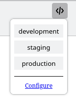

# switch_env

Replaces host in current URL keeping path and parameters.

Useful for changing environments during development.



# Configuration

switch_env configuration is a `json` Array:

```
[
  {
    'development': 'http://localhost:3000',
    'staging': 'https://staging.myapp.com',
    'production': 'https://production.myapp.com'
  }
]
```

Each Hash in the Array is a group of environments (i.e. an application).

The key of each entry is the name and the value is the URL.

You can add multiple applications to the Array:

```
[
  {
    'development': 'http://localhost:3000',
    'staging': 'https://staging.myapp1.com',
    'production': 'https://production.myapp1.com'
  },
  {
    'development': 'http://localhost:3001',
    'staging': 'https://staging.myapp2.com',
    'production': 'https://production.myapp2.com'
  }
]
```

And multiple URLs in environments:

```
[
  {
    'development': 'http://localhost:3000',
    'staging': [
      'https://staging.myapp.com',
      'https://stag_alias.myapp.com'
    ],
    'production': [
      'https://production.myapp.com',
      'https://prod_alias.myapp.com'
    ]
  }
]
```
